# Project: NewsSentiment & TickerTracking

Contributors:

* Jatinder Singh
* Renae Martinez
* Heena Roy

## Project Abstract
Analyze stock data in correlation to sentiments from different stock news sources and determine what (if any) impact it has on stock prices.

## Scope and Assumptions
- Ticker: TSLA
    - To create a working prototype, we decided to look at one stock only. We picked TSLA as it seems to have more daily news and articles than many other stocks, as well as volatility in its price. 

- Stock price source: YFinance
    - We chose to use YFinance sdk to download historical stock prices as it was fairly easy to use and gave us all we needed.
    

- Time Period: 2019
    - We did not want to include 2020 as the year has seen some unprecedented events in the history of the stock market.

- News/Articles Data: StockNewsAPI.com & BreakingAPI.com
    - Initial TSLA articles were pulled from StockNewsAPI. However, StockNewsApi does not return full articles, only snippets, headlines, URLs and its own sentiment analysis scores. A custom function was created to take the news URL from StockNewsAPI, pass it to BreakingAPI, and pull the full text of the article. 

|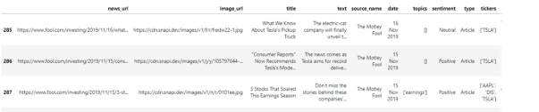|
|---|
|DataFrame created from data downloaded from StockNewsApi|

|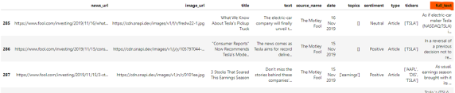|
|---|
|Modified Dataframe after downloading full text from breakingapi.com|

## Data Preparation, Cleaning and Processing

### Tools for Extracting Sentiments

Sentiment analysis is a machine learning technique that detects polarity – positive or negative - within text. The models often focus on polarity but also on emotions e.g. angry, happy, sad, etc. or even intentions, interested or not interested. We only looked at polarity, a range of positive to negative, +1 to -1.

Because our focus is on stock market returns, we looked at articles that spoke to a particular stock – Tesla in our case – and decided to see if sentiments of news articles do, in fact, have a bearing on stock prices. We only looked at the articles of 2 sources, The Motley Fool and Zacks Investment Research for the year 2019. Full texts of 289 articles were processed through 2 different Sentiment Analysis Models:

- VADER (Valence Aware Dictionary and sEntiment Reasoner) is a lexicon and rule-based sentiment analysis tool that is specifically attuned to sentiments in social media. This tool gives us 4 rating scores: Positive, Neutral, Negative, and Compound. Positive, Neutral, and Negative are given a ranking score within each document, with a Compound score for total polarity. The Compound score was used in our analysis. 
 
- TextBlob is a python library for processing textual data. This tool gives us 2 ratings scores: Polarity and Subjectivity. The Subjectivity scored whether the document was objectively or subjectively weighted, while the Polarity score rated the article based on positive or negative sentiment. The Polarity score was used in our analysis. Unlike VADER, input text needs to be preprocessed to tokens, because of this we ran this model twice, we wanted to see if this had any effect on the polarity and the predictive power of the sentiment:

    - Lemmatizer breaks the word down to its root, dropping contractions, plurals, etc. 
    
    - PorterStemmer breaks the word down to its roots as does the Lemmatizer, however stemming is much stricter at stripping the words.
    

- We also used a sentiment score from StockNewsAPI.  We took their analysis at face value.

### Bag of Words Visualizations

After processing the Sentiments Analysis, we were left with a "Bag of Words" from the full articles. We realize that these words could be of value as well, and additional analysis could be done to see if there is any predictive power. However because that was not within the scope of the project, we did not pursue it further. We did play with the "Bag of Words" to create a few visuals below:

|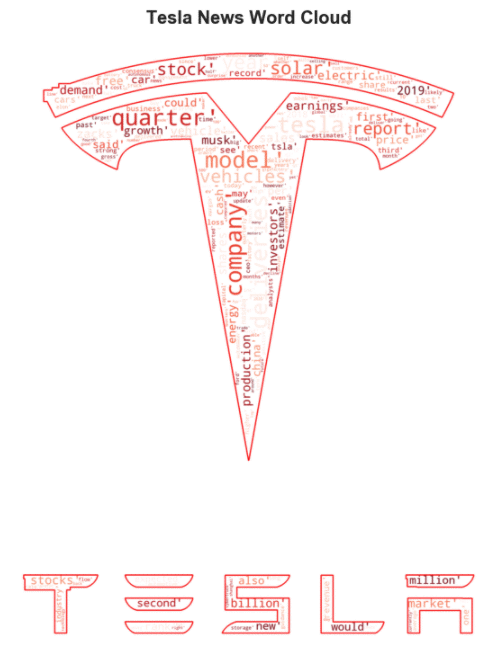 | 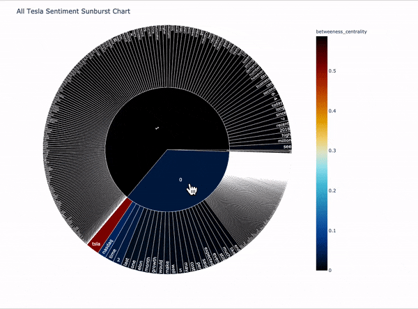|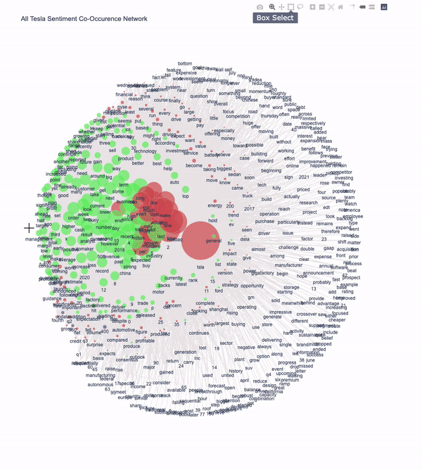 | 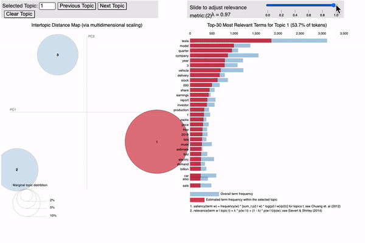|
|:---:|:---:|:---:|:---:|
| Tesla Word Cloud | Tesla Word Sunburst | Tesla Word Co-Occurrence Network | Tesla Word Community Topics |

### Merging Stock Prices and News Sentiment Data

We created dataframes containing TSLA stock data, sentiment analysis from stocknewsapi and CSV files created by our custom code and joined them to create a final dataframe that was used for regression analysis.

|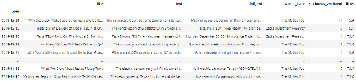|
|---|
|Stocknewsapi sentiment translated to a numeric value|

|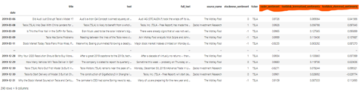|
|---|
|Added sentiments from our custom code to the previous dataframe|

|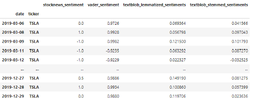|
|---|
|Cleaned-up dataframe containing only the columns we needed|

|")|
|---|
|Merged Tesla stock closing prices for the respective dates (DataFrame 1 used for Regression Analysis)|

|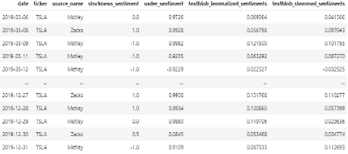|
|---|
|Dataframe grouped by date and source|

|")|
|---|
|Source_name values transposed to columns (DataFrame 2 used for Regression Analysis)|

# Regression Analysis

## Sentiment Analysis Data Preparation

- News articles for Tesla were not available for every trading day
- Filled missing sentiment analysis with hysteresis prior to regression analysis

## Monte Carlo Regression Analysis

A monte carlo analysis was performed on 2 sentiment analysis data frames (All Sentiments and Sentiments by News Source) to determine which feature (sentiment analysis) has the best correlation to daily returns. The analysis was performed using two different monte carlo functions which iterated over 20 days.

1. Model 1: Lasso Regression
    - https://towardsdatascience.com/ridge-and-lasso-regression-a-complete-guide-with-python-scikit-learn-e20e34bcbf0b

2. Model 2: Lasso Regression using LogisticRegression
    - https://towardsdatascience.com/feature-selection-using-regularisation-a3678b71e499

### Model 1 Monte Carlo Results - All Sentiments:

|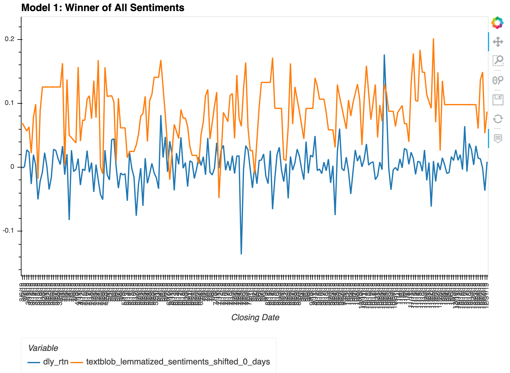 | 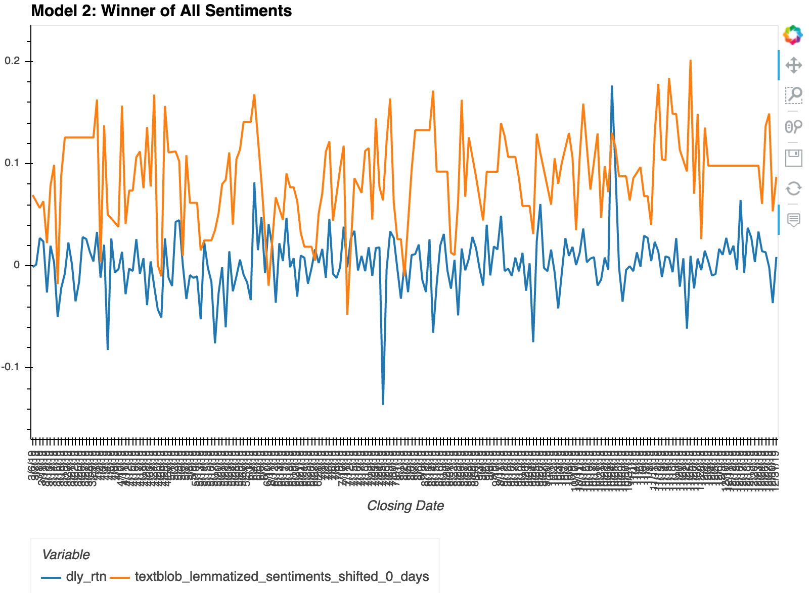|
|:---:|:---:|
| Model 1 Lasso Regression | Model 1 Lasso Regression using LogisticRegression |

|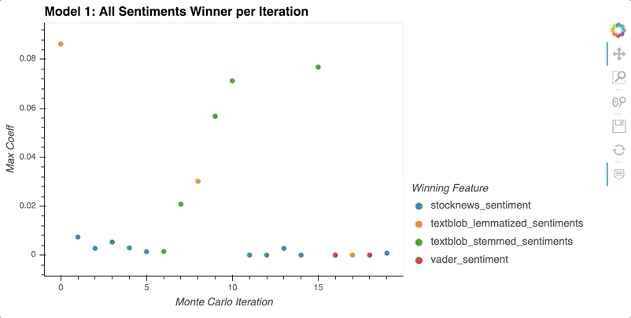 | 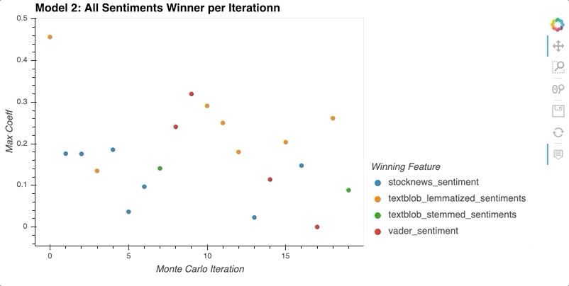|
|:---:|:---:|
| Model 1 Lasso Regression ScatterPlot | Model 1 Lasso Regression using LogisticRegression ScatterPlot |

### Model 2 Monte Carlo Results - Sentiments by News Source:

|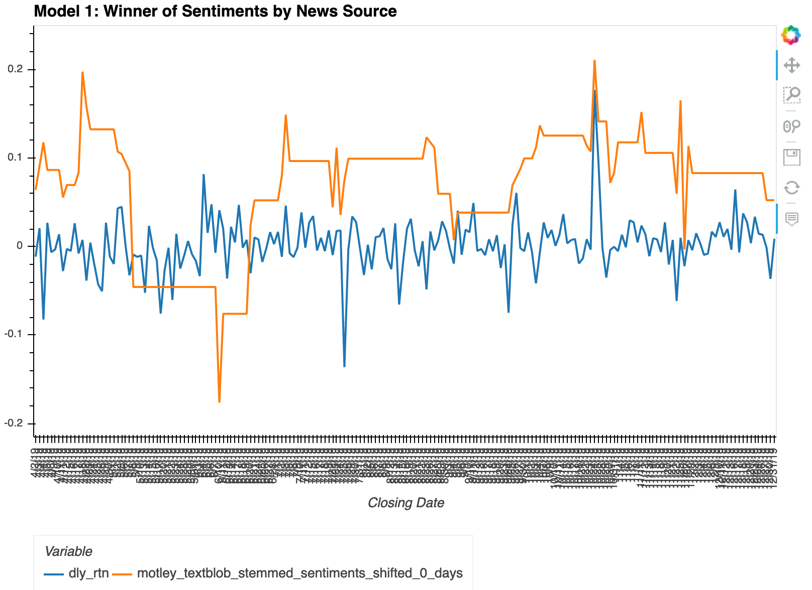 | 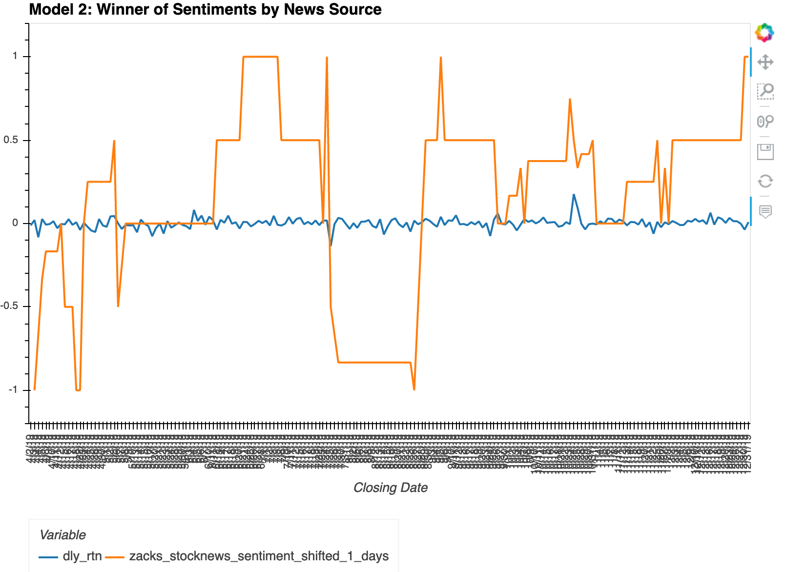|
|:---:|:---:|
| Model 2 Lasso Regression | Model 2 Lasso Regression using LogisticRegression |

|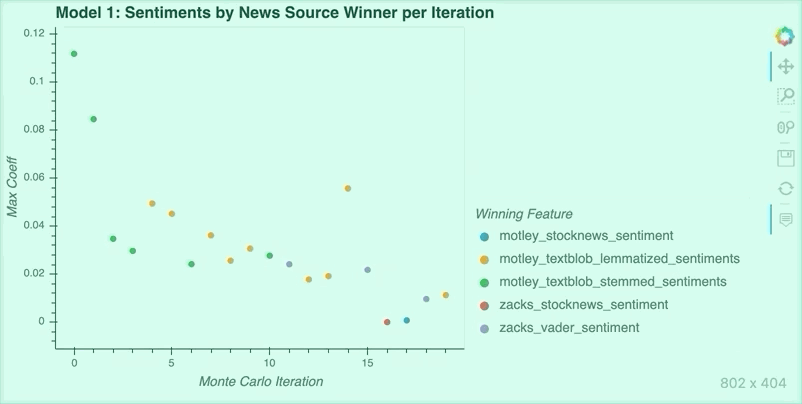 | |
|:---:|:---:|
| Model 2 Lasso Regression ScatterPlot | Model 2 Lasso Regression using LogisticRegression ScatterPlot |

## Conclusion

The charts above identify the winning feature (sentiment analysis) per iteration for each of the monte carlos performed. From analyzing the data, we confirmed that the overall winner shown on the hvplots isn’t necessarily the feature that won the most times over the 20 day iteration.  For the All Sentiment data frame, the textblob sentiment analysis has the most correlation to Tesla’s stock returns.  For the Sentiment by News Source data frame, Model 1 predicts that Motley Fool has the best correlation to Tesla’s stock returns, whereas Model 2 predicts Zacks has the best correlation. 

### Enhancements Opportunities

- Run analysis over a longer period of time (current analysis is only for 9 months.
- Data mine for additional articles on stock for more sentiment analysis data.
- Further customization of sentiment analysis on given article.
    - Determine if article was written for Tesla vs Tesla being mentioned in the article. 
- Integrate volume of sales data and sell ‘type’ (industry vs retail) into regression analysis.

Resources:

https://breakingapi.com/article-extraction-api

https://medium.com/@Intellica.AI/vader-ibm-watson-or-textblob-which-is-better-for-unsupervised-sentiment-analysis-db4143a39445

https://towardsdatascience.com/sentiment-analysis-vader-or-textblob-ff25514ac540

https://towardsdatascience.com/create-word-cloud-into-any-shape-you-want-using-python-d0b88834bc32

https://www.kaggle.com/takanobu0210/twitter-sentiment-eda-using-nlplot
